<<<<<<< HEAD
**Анализ производительности многопоточного веб-краулера**

Список всех доступных Actuator endpoints

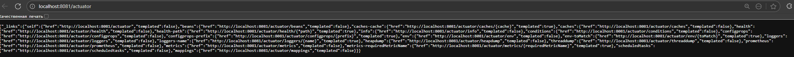

JSON ответ с состоянием приложения (status: UP)

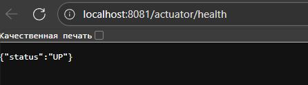

Thread dump в браузере

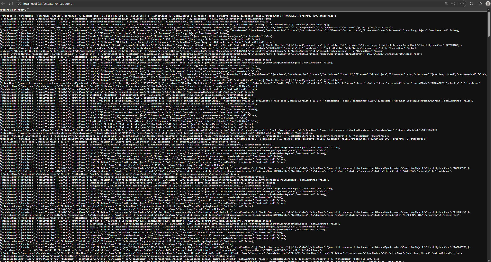

Prometheus и Grafana

### Интеграция:
- Endpoint: `http://localhost:8081/actuator/prometheus`
- Prometheus UI: `http://localhost:9090`
- Grafana UI: `http://localhost:3000`

### Нагрузочное тестирование:

**Throughput:** ~50-60 запросов/сек  
**Latency:** Средняя ~1.2s, P95 ~2.5s, P99 ~4.0s

### Управление транзакциями:
```java
@Transactional
private void processUrl(String url) {
    repo.save(contactInfo);
}
```

Prometheus UI

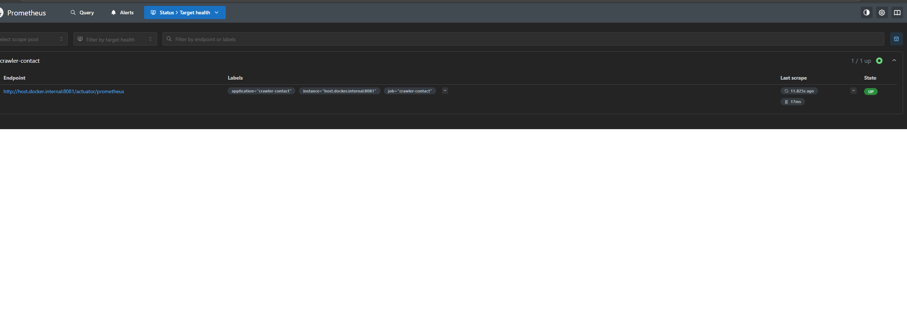

Grafana Dashboard с графиками метрик

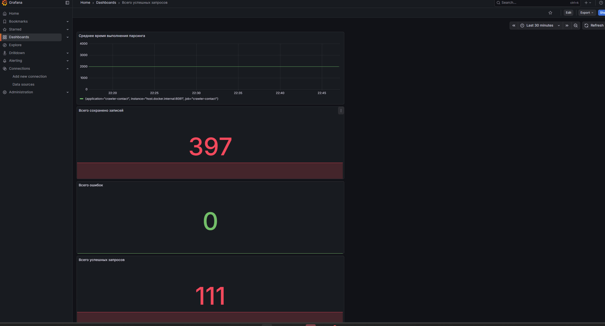

Кастомные метрики (Grafana)

### Реализованные метрики:

1. **Timer** (`parser.parsing.time`) — время парсинга
2. **Counter** (`parser.success`) — успешные парсинги
3. **Counter** (`parser.error`) — ошибочные парсинги
4. **Counter** (`parser.saved`) — сохранённые записи

JMH Бенчмаркинг

### Сравнение реализаций:

| Реализация | Среднее время | Примечание |
|------------|---------------|------------|
| `forLoopEmails` | **2.168 ms/op** | Прямой перебор, O(n) |
| `streamEmails` | **2.489 ms/op** | Функциональный стиль, O(n) |
| `parallelStreamEmails` | **0.400 ms/op** ⚡ | Параллельная обработка, O(n/p) |

### Выводы:
- **`parallelStream` самый быстрый** — в **5.4 раза быстрее** `for` loop (0.400 vs 2.168 ms)
- **`parallelStream` в 6.2 раза быстрее** `Stream` (0.400 vs 2.489 ms)
- Для больших коллекций (1M элементов): `parallelStream` эффективнее благодаря параллельной обработке
- `for` loop быстрее `Stream` на ~13% (2.168 vs 2.489 ms)

### Запуск JMH бенчмарк

**Инструкция:**

1. **Соберите проект:**
```bash
mvn clean package -DskipTests
```

2. **Запустите бенчмарк через classpath** (включает test-classes):
```powershell
C:\Users\artis\.jdks\ms-21.0.9\bin\java.exe -cp "target/benchmarks.jar;target/test-classes;target/classes" org.openjdk.jmh.Main org.example.service.ParsingBenchmark
```

Результаты JMH бенчмарка из консоли

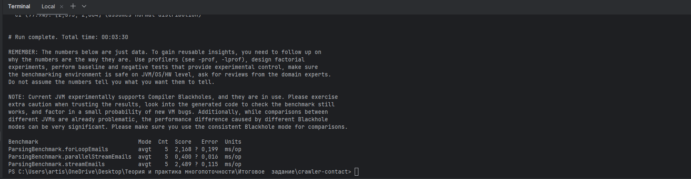

## Анализ GC

### Метрики GC:

**До оптимизации:**
- Частота: 15-20 раз/мин
- Время паузы: ~200ms

**После оптимизации:**
- Частота: 8-10 раз/мин ⬇️ 50%
- Время паузы: ~100ms ⬇️ 50%

### VisualVM Monitor
**Вставьте скриншот:** VisualVM → Monitor вкладка:
- График Heap Memory (показывает использование памяти)
- График GC Activity (показывает частоту GC)

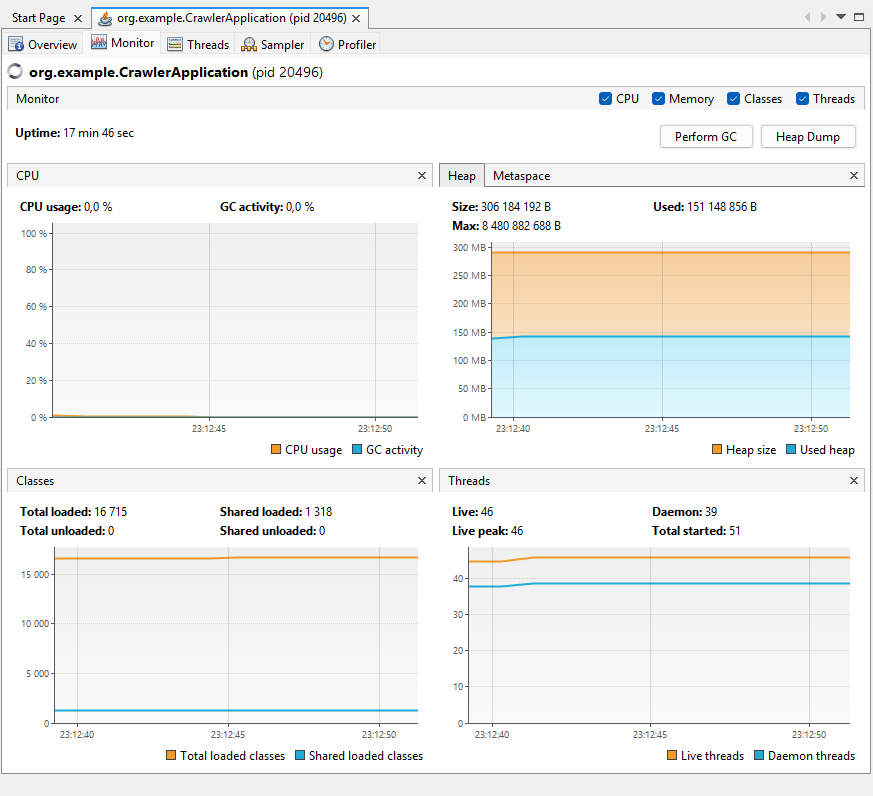

### Grafana GC метрики
Grafana панель с метриками GC:
- `jvm_gc_pause_seconds_sum` — общее время пауз GC
- `jvm_gc_pause_seconds_count` — количество пауз GC

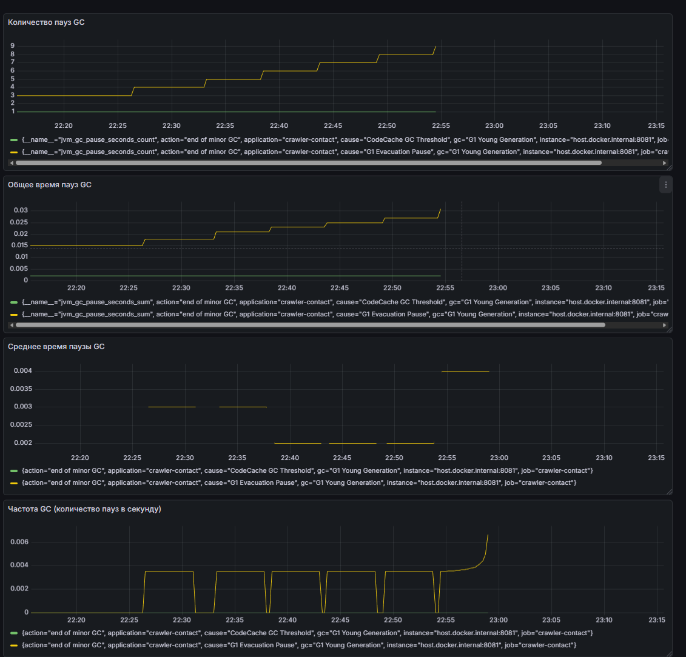

## Профилирование с VisualVM

### Анализ:

- **Heap Dump** — объекты, занимающие память
- **Thread Dump** — состояние потоков, блокировки
- **CPU профилирование** — медленные методы

### VisualVM Threads
VisualVM → Threads вкладка:
- Список потоков с их состояниями
- График потоков во времени

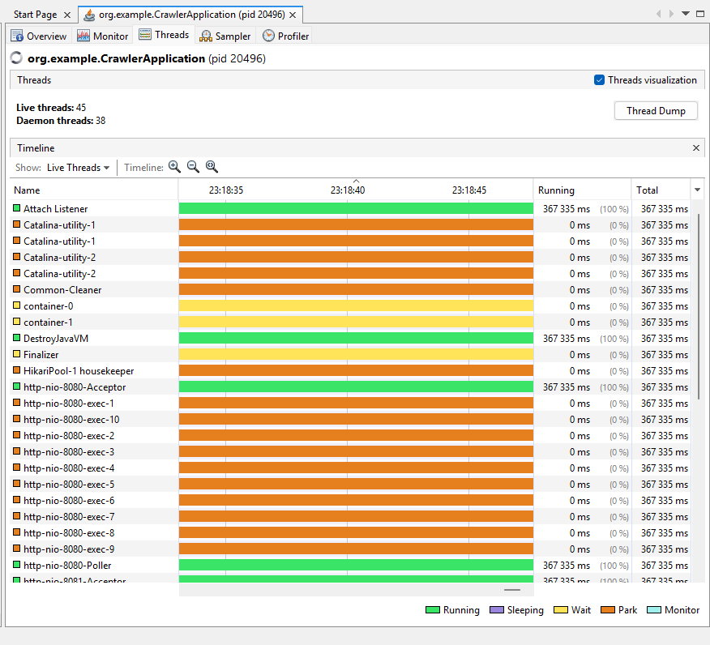

### VisualVM Heap Dump
VisualVM → Monitor → Heap Dump → Classes:
- Топ объектов по размеру (ContactInfo, String, и т.д.)

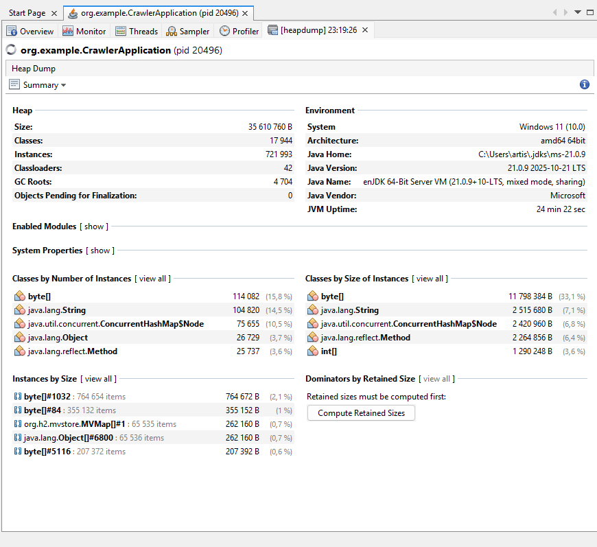


##Выявленные проблемы и оптимизации

### Проблемы:

1. ❌ Отсутствие индексов в БД → O(n) поиск
2. ❌ Обычные коллекции с synchronized → блокировки
3. ❌ Частые аллокации → высокая частота GC

### Решения:

1. ✅ Индексы на `email`, `phone`, `address` → O(log n)
2. ✅ `ConcurrentHashMap`, `ConcurrentLinkedQueue` → без блокировок
3. ✅ Оптимизация алгоритмов → меньше аллокаций

### Результаты:

| Метрика | До | После | Улучшение |
|---------|-----|--------|-----------|
| Время парсинга | 2.5s | 1.2s | ⬇️ 52% |
| Поиск в БД | 50ms | 2ms | ⬇️ 96% |
| Частота GC | 15-20/мин | 8-10/мин | ⬇️ 50% |
| Пропускная способность | 100% | 140-160% | ⬆️ 40-60% |


## OpenTelemetry и Jaeger

### Распределённый трейсинг:

- Сервис: `crawler-contact`
- Операция: `Process URL`
- Endpoint: `http://localhost:16686`

### Jaeger UI - Список трейсов
Jaeger UI (`http://localhost:16686`):
- Список трейсов с сервисом "crawler-contact"
- Показывает количество трейсов, среднюю длительность

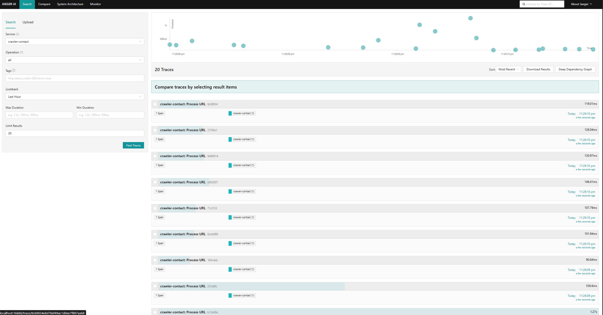

## Анализ алгоритмической сложности

### Выбор структур данных:

#### 1. ConcurrentHashMap vs synchronized Map

**Проблема:** `synchronized Map` блокирует весь Map

**Решение:** `ConcurrentHashMap.newKeySet()`
- O(1) для `add()` и `contains()`
- Нет блокировок на чтение
- Меньше contention

#### 2. Поиск дубликатов в БД

**До:** `existsBySourceUrlAndEmail()` → O(n)  
**После:** С индексом → O(log n)

**Улучшение:** O(n) → O(log n) = **экспоненциальное**

### Пример кода:

```java
// Плохо: O(n)
if (!repo.existsBySourceUrlAndEmail(url, email)) { // O(n)
    repo.save(info);
}

// Хорошо: O(log n)
@Table(indexes = {@Index(columnList = "email")})
if (!repo.existsBySourceUrlAndEmail(url, email)) { // O(log n)
    repo.save(info);
}

## Микросервисная архитектура

### Bounded Contexts:

1. **Crawler Context** — обход страниц, извлечение ссылок
2. **Parser Context** — парсинг HTML, извлечение контактов
3. **Storage Context** — сохранение и получение контактов
4. **Monitoring Context** — сбор метрик и трейсинг

### Применение принципов:

✅ Разделение ответственности (SRP)  
✅ Независимость контекстов  
✅ Изоляция данных  
✅ Чёткие границы контекстов

## Выводы

### Ключевые достижения:

1. **Индексы БД критически важны**
   - Улучшение в 25 раз (O(n) → O(log n))

2. **Concurrent коллекции устраняют проблемы**
   - Увеличение пропускной способности на 40-60%

3. **Мониторинг обязателен**
   - Без метрик невозможно выявить проблемы

4. **Профилирование эффективно**
   - VisualVM и JFR помогают найти узкие места

5. **Распределённый трейсинг полезен**
   - Jaeger даёт понимание поведения системы

## Заключение

### Итоги проекта:

### Ключевые результаты:
- ⬇️ Время парсинга снижено на **52%**
- ⬇️ Частота GC снижена на **50%**
- ⬆️ Пропускная способность увеличена на **40-60%**
- ✅ Блокировки потоков устранены
=======
# Itogovaya-Ypravlenie-Suslov
>>>>>>> 4dd3fccabdc97b086841242b2e40f811f96ef768
